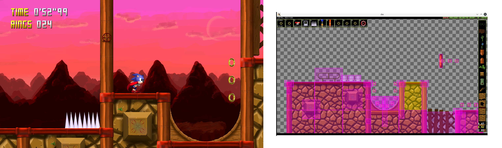

# qt-sonic

This is a demo of a Sonic the Hedgehog game engine, implemented in Qt/QML.

It started in the end of 2014 as something to do in a long winter with no money,
and was mostly abandoned some time later, but I decided to dust it off because it is still something interesting.

I don't expect to be working on this again anytime soon, but it would be nice to complete 
at least one demo level at some point. Someday. Qt has already gone through two major releases (from 4 to 6)
since this was started!


Screenshots of the game and the level editor.

## Features

* Original physics recoded from scratch using the [Sonic Physics Guide](https://info.sonicretro.org/Sonic_Physics_Guide) from the Sonic Retro community.
    * They were not kept exactly the same, though! Everything was made to work in floating point, with real raycasting and iterative physics steps. Values were recalculated
      to have the same effects but now work in various framerates in the same way.
    * Box2D is used for level geometry and raycasting. 
    * There is no need for manual angle arrays or prefab shapes, all angles are determined from geometry.
* Built-in level editor, completely integrated into the engine, that can be summoned anytime from debug mode.
* Custom systems to supplement some defficiencies of QML for games:
    * Hierarchical spatial object activation and culling.
    * Custom sprite and spritesheet system.
    * Spatial audio.

## Building


You will need Qt 5, Box2D, SDL2 and OpenAL. SDL2 is used exclusively for game controller support.

Make sure to init and update submodules, `neiasound` and `SDL_GameControllerDB` are brought in as such.


### Linux

When all dependencies (including headers) are installed, just build with `qmake` as normal. Example:

```bash
# Create a build folder from the project directory and buyild there
$ mkdir build && cd build
$ qmake ..
$ make 

# Then run the resulting binary, also from the project directory
$ cd ..
$ ./build/qt-sonic
```

### Windows

This project was built for Windows before, also using QtCreator, but that was a while ago.
It is not guaranteed to work out of the box in any way. You need to review the project file to make sure all the dependencies are found correctly, depending on how they were installed/built. Other that that it should be smooth sailing.


### Android

It is also possible to build for Android, just follow the normal procedure of 
building Android projects using QtCreator. You will need to supply your own choice of
OpenAL and Box2D implementations to the build. Some Android directives in the .pro file 
assume you are using LiquidFun and OpenSLES, and you will want to edit those to suit your needs.

## License

The engine is licensed under the GPL V3.0 license. 
Dependencies have their own licenses.

Any original assets made for this are hereby licensed as [CC-BY-SA 4.0](https://creativecommons.org/licenses/by-sa/4.0/deed.en), 
to the extent of their originality (if that makes any sense).

I don't own many of the placeholder assets used thoughout this demo, those
are the property of their respective owners. They can be scrapped and replaced on demand.

Sonic is a property of SEGA and they own most, if not all, of the placeholder assets. 
This is just a tech demo made for fun.
